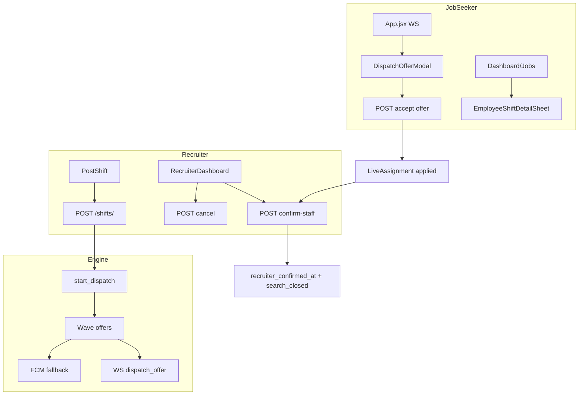

# MediRoute Shift Dispatch System — Operational Audit (Pilot Readiness)

**Audit type:** Read-only, code-path + prior log evidence  
**Date:** May 2026  
**Codebase reference:** `main` (includes recruiter-confirm lifecycle, cancel cleanup, Alembic restore `d157984`)  
**Scope:** Instant staffing / dispatch only (not full job-board ATS)

---

## Executive summary

MediRoute Phase 1 is a **single-instance, wave-based staffing engine** with WebSocket-primary delivery and FCM fallback. The intended product model is **marketplace selection** (apply → recruiter confirms), not Uber-style auto-confirm. Core paths are implemented end-to-end in code, but **pilot readiness is uneven**: realtime + apply/confirm/cancel are materially improved; **check-in/out has no mobile UI**; **multi-nurse (`nurses_required > 1`) is only partially modeled**; **migrations and runtime DDL guards coexist** (operational risk); **FCM on Android debug builds is misconfigured** in observed logs.

**Overall pilot readiness (honest): 6/10** for a controlled Hyderabad pilot with ops support—not yet for unattended scale.

---

## 1. Architecture overview

### 1.1 Backend module map

| Module | Path | Responsibility |
|--------|------|----------------|
| **Dispatch engine** | `mediroute-backend/app/dispatch/engine.py` | Wave dispatch, offer delivery (WS+FCM), accept signaling, metrics, session events |
| **Offer policy** | `mediroute-backend/app/dispatch/offer_policy.py` | Search open/closed, respondable offers, blocking assignment rules |
| **Eligibility** | `mediroute-backend/app/dispatch/eligibility.py` | City/role visibility, **50 km** accept gate, pincode bands, Haversine |
| **Janitor** | `mediroute-backend/app/dispatch/janitor.py` | Stale WS prune, offer expiry at shift start, session cleanup |
| **Events (audit)** | `mediroute-backend/app/dispatch/events.py` | Timeline event type constants |
| **Shift API** | `mediroute-backend/app/routes/shifts.py` | CRUD, browse, confirm-staff, cancel, stop-search, check-in/out, DDL guards |
| **Dispatch API** | `mediroute-backend/app/routes/dispatch_routes.py` | Accept/decline offer, pending offers, WS endpoint |
| **WS manager** | `mediroute-backend/app/ws_manager.py` | In-memory per-user connections, stale prune (90s) |
| **Ops** | `mediroute-backend/app/routes/ops.py` | Admin cancel/retry/manual assign, metrics |
| **Models** | `mediroute-backend/app/models.py` | `ShiftRequest`, `DispatchSession`, `DispatchOffer`, `LiveAssignment`, `ReliabilityScore`, timeline |

**Startup:** `Procfile` / `render.yaml` → `alembic upgrade head && uvicorn …`

### 1.2 Frontend module map

| Module | Path | Responsibility |
|--------|------|----------------|
| **WS + offer UX** | `frontend/src/App.jsx` | Global WS handler, dispatch modal, reconnect banner |
| **WS hook** | `frontend/src/hooks/useWebSocket.js` | Connect, ping 25s, backoff, resume reconnect, pending-offer recovery |
| **Recruiter live state** | `frontend/src/context/DispatchContext.jsx` | Per-shift latest hospital WS event (10 min TTL) |
| **Recruiter UI** | `frontend/src/pages/RecruiterDashboard.jsx` | Shifts list, cancel, confirm applicant, live cards |
| **Applicant panels** | `frontend/src/components/recruiter/*` | Applicants, confirm, profile sheet |
| **Job seeker** | `frontend/src/pages/Dashboard.jsx`, `Jobs.jsx` | Offers, active shift, cancelled history |
| **Detail sheet** | `frontend/src/components/EmployeeShiftDetailSheet.jsx` | Apply/decline, pending/confirmed/cancelled states |
| **Copy/helpers** | `frontend/src/utils/staffingStatusCopy.js`, `nurseActiveShift.js` | User language, active vs pending vs finalized |
| **Location** | `frontend/src/utils/geocodePincode.js`, `AvailabilityContext.jsx` | GPS, reverse geocode, pincode fallback |
| **Push** | `frontend/src/hooks/usePushNotifications.js` | FCM registration (Android) |
| **Logging** | `frontend/src/utils/mobileLogger.js` | `mlog` → `files/mr-logs/app.log` on device |

### 1.3 Lifecycle ownership (diagram)

---

## 2. Complete shift lifecycle (13 stages)

### Stage 1 — Recruiter posts shift

| Layer | Behavior |
|-------|----------|
| **API** | `POST /shifts/` — verified recruiter only, idempotency key |
| **DB** | `ShiftRequest` status `open`; timeline `shift.created` |
| **DDL** | `_ensure_shift_location_columns`, `_ensure_assignment_columns` at runtime (if migration lag) |
| **Engine** | `background_tasks.add_task(start_dispatch, shift.id)` |
| **Failure** | Unverified recruiter 403; past `shift_start` 400; DB 500 if schema drift (historically `hospital_pincode`, `_to_utc_naive` — fixed in recent commits) |
| **Evidence** | Device logs: `post_shift_gps_ok`, locality labels; Render 500s traced to schema/NameError in prior sessions |

### Stage 2 — Location resolution

| Layer | Behavior |
|-------|----------|
| **Frontend** | `PostShift.jsx` + `geocodePincode.js` — native GPS → backend `/geo/reverse` → locality + pincode |
| **Backend** | Stores `hospital_latitude/longitude`, `hospital_pincode`, `hospital_locality` on shift |
| **Failure** | GPS denied → pincode/manual; reverse geocode failure → pincode-only display |
| **Confidence** | **High** for pilot (logs show `backend_geo_ok`, `reverse_parse`) |

### Stage 3 — Matching eligibility (who gets offers)

| Rule | Implementation |
|------|----------------|
| **Pool** | Online/available nurses in city + matching `role_required` (engine candidate query) |
| **Visibility (browse)** | `nurse_shift_visible` — same city + role (all shown in Phase 1) |
| **Accept gate** | `nurse_accept_eligible` — **≤ 50 km** GPS Haversine, else pincode band 0/1 proxy |
| **Limitation** | Offers can reach nurses **outside 50 km**; accept blocked with “prioritizing nearby staff” |

### Stage 4 — Notifications sent

| Channel | When |
|---------|------|
| **WebSocket** | Primary: `dispatch_offer` payload with `accept_eligible`, `distance_km` |
| **FCM** | If WS not connected; `send_dispatch_offer` in executor |
| **Failure** | WS offline → relies on FCM; device logs show `fcm_registration_error` (invalid Firebase API key on debug APK) |
| **Recovery** | On WS reconnect: `GET /dispatch/offers/pending` replays offers |

### Stage 5 — Job seeker visibility

| Surface | Behavior |
|---------|----------|
| **Jobs browse** | `GET /shifts/browse` — open/dispatching, future start, excludes own non-cancelled assignment |
| **Dashboard** | Pending offers list + active shift from `GET /shifts/` |
| **Modal** | `dispatch_offer` opens `DispatchOfferModal` (minimize/reopen supported) |

### Stage 6 — Job seeker applies

| Layer | Behavior |
|-------|----------|
| **API** | `POST /dispatch/offers/{id}/accept` |
| **DB** | Offer `accepted`; `LiveAssignment` created (`status=confirmed`, **`recruiter_confirmed_at` NULL**) |
| **WS nurse** | `application_submitted` |
| **WS recruiter** | `nurse_applied` with `applied_count` |
| **NOT** | Shift is **not** finalized; search continues |
| **Blocking** | `nurse_blocks_other_acceptances` — only recruiter-confirmed or checked-in blocks **other** shifts; pending apply does not |

### Stage 7 — Recruiter reviews

| Layer | Behavior |
|-------|----------|
| **API** | `GET /shifts/`, `GET /shifts/{id}` + `_attach_recruiter_staffing` |
| **Applicant status** | `applied` vs `confirmed` (recruiter-confirmed) |
| **UI** | `ShiftApplicantsPanel`, `AssignedNurseCard`, profile sheet |
| **Contact** | Hospital phone to nurse only after recruiter confirms (`_attach_hospital_contact`) |

### Stage 8 — Recruiter confirms

| Layer | Behavior |
|-------|----------|
| **API** | `POST /shifts/{id}/confirm-staff` `{ nurse_user_id }` |
| **DB** | Sets `recruiter_confirmed_at`; other assignments `cancelled`; `search_closed_at`; shift `filled`; dispatch stopped |
| **WS** | Selected: `assignment_confirmed`; others: `offer_revoked`; recruiter: `shift_filled`, `shift_search_stopped` |
| **Success criteria** | Single selected nurse operational; search closed |

### Stage 9 — Shift finalized (operational)

| State | `shift.status=filled`, `search_closed_at` set, confirmed nurse `online_busy` |
| **Risk** | `_expire_shift_if_past_start_unfilled` treats **any** assignment row as “filled” at shift start—even **unconfirmed** apply (see §6) |

### Stage 10 — Shift start

| Behavior | Auto-expire path if still open/dispatching and past start with no assignment → `expired` |
| With assignment (any) | May auto-close search and mark `filled` without recruiter confirm |

### Stage 11 — Completion (check-in/out)

| API | `POST /shifts/{id}/checkin` (200m GPS), `POST /shifts/{id}/checkout` |
| **Requires** | Recruiter confirmed for check-in |
| **Frontend** | **No dedicated check-in/out UI** in `frontend/src` — **API-only / pilot gap** |
| **Reliability** | `ReliabilityScore.completed_shifts` incremented on checkout |

### Stage 12 — Review/rating

| Status | **Not implemented** for shift dispatch lifecycle |
| Reliability | Offer accept/decline/timeout + completed_shifts; display defaults to **100%** for new/low-history users (`_reliability_display_score`) |

### Stage 13 — Closure

| Paths | `completed`, `cancelled`, `expired`, `no_show` (latter not fully wired in UI) |
| Recruiter archive | `job_recruiter_archives` + shift archive endpoint (hide from dashboard, audit retained) |

---

## 3. State machine audit

### 3.1 `ShiftRequest.status` (DB enum)

| State | Meaning |
|-------|---------|
| `open` | Created; may not be dispatching yet |
| `dispatching` | At least one wave / application activity |
| `filled` | Search closed with confirmed staffing (or legacy auto paths) |
| `expired` | Past start, no viable fill |
| `cancelled` | Recruiter cancelled |

**Valid transitions (observed):**  
`open → dispatching → filled | expired | cancelled`  
`dispatching → open` (stop-search without fill)  
Re-dispatch from `cancelled|expired` via `POST re-dispatch`

**Invalid / risky:**

- `filled` while applicants still unconfirmed (expire-at-start path)
- Cannot cancel `filled` shifts (409)

### 3.2 Application layer (logical — frontend + API)

| Logical state | Backend signals |
|---------------|-----------------|
| **Invited** | Pending `DispatchOffer` |
| **Applied** | `LiveAssignment` + `recruiter_confirmed_at` NULL |
| **Under review** | Same as applied (UX copy) |
| **Confirmed** | `recruiter_confirmed_at` set OR legacy `search_closed` |
| **Not selected** | Assignment `cancelled` after another confirmed |
| **Cancelled shift** | Shift `cancelled` + assignment `cancelled` |

### 3.3 `LiveAssignment.status`

`confirmed` → `checked_in` → `completed` | `cancelled` | `no_show`

**Naming debt:** `confirmed` is used for **unconfirmed applications** (DB default on create)—confusing for audits.

### 3.4 Stale-state and race risks

| Risk | Severity |
|------|----------|
| WS missed → pending offers API recovers | Medium — mitigated |
| Double WS `dispatch_offer` | Low — dedupe by `offer_id` in App.jsx |
| Accept race (two nurses) | Low — DB unique `(shift_id, nurse_user_id)`; engine SKIP LOCKED on offers |
| Unconfirmed assignment at shift start → auto `filled` | **High** — `_expire_shift_if_past_start_unfilled` counts any assignment |
| Local `alembic/versions` missing on disk vs git | **High** for local dev; **fixed in git** `d157984` for Render |
| Runtime `ALTER TABLE IF NOT EXISTS` vs Alembic | Medium — dual path can hide drift until deploy |

---

## 4. Success flows (working with evidence)

| Flow | Confidence | Evidence |
|------|------------|----------|
| Post shift + GPS/locality | **8/10** | `post_shift_gps_ok`, `reverse_parse` in mr-logs |
| Wave dispatch + WS offers | **8/10** | `ws_dispatch_offer`, engine metrics |
| Apply → pending review copy | **8/10** | `application_submitted`, `staffingStatusCopy` |
| Recruiter confirm → finalize | **7/10** | `confirm-staff` + WS map in shifts.py |
| Cancel → release assignments + WS | **7/10** | Recent fix: `shift_cancelled` to all affected nurses |
| Recruiter dashboard live updates | **7/10** | DispatchContext + refresh events |
| WS reconnect + pending offers | **8/10** | `useWebSocket` + `pending_offers_recovered` pattern |
| 50 km accept restriction | **7/10** | `eligibility.py` + UI blocked message |
| Pincode-first labels | **7/10** | areaLabel + hospital_locality fields |
| Cancelled shift history (dashboard) | **6/10** | Recent UI section; detail sheet (`isConfirming` bug fixed) |

---

## 5. Failure flows (known)

| Failure | Severity | Repro | Impact |
|---------|----------|-------|--------|
| Alembic revision missing (`e5f6a7b8c9d0`) | **P0** | Deploy without d4/e5 files | Render won't start — **fix committed `d157984`** |
| DB column drift vs model | **P0** | Render DB behind code | 500 on post shift — mitigated by DDL guards + migrations |
| Stale active shift after cancel | **P0** | Cancel before fix | Blocked new accepts — **mitigated** |
| `isConfirming` undefined (detail sheet) | **P1** | Open cancelled shift | Error boundary — **fixed** |
| FCM invalid API key (debug) | **P1** | Android debug build | No push when WS dead |
| Auto-fill at shift start with unconfirmed apply | **P1** | Time passes, applicant not confirmed | Shift marked filled incorrectly |
| No check-in/out mobile UI | **P1** | N/A | Cannot complete operational loop in app |
| `nurse_accepted` WS type legacy in recruiter UI | **P2** | Old events | Card status may use legacy type |
| Single Render instance WS | **P1** | Scale-out | No cross-instance WS (documented Phase 2 Redis) |
| ERR_NETWORK on Render cold start | **P2** | App resume | Brief failed API; reconnect scheduled in logs |

---

## 6. Edge case matrix

| Edge case | Current behavior | Expected | Gap / risk |
|-----------|------------------|----------|------------|
| Cancel after apply, before confirm | Assignments cancelled; `shift_cancelled` WS; browse unblocked | Yes | **Fixed** (recent) |
| Cancel after recruiter confirm | 409 cannot cancel filled | Correct for v1 | Recruiter must use ops path |
| Multiple applicants | All can apply; confirm picks one; others `cancelled` | Yes | OK |
| Multiple `nurses_required > 1` | Counts in messages; confirm one at a time | Partial | **No clear multi-confirm UX** to fill N slots |
| Reconnect during confirm | REST refresh on events | OK | Race window seconds |
| App background/resume | Capacitor `appStateChange` → WS reconnect | OK | Logs: WS 1006 + reconnect |
| Duplicate accept same shift | 409 same shift | OK | |
| Accept second shift while applied to first | **Allowed** (pending doesn't block) | Product choice | Could overload nurses |
| Expired shift in list | Filtered from browse | OK | List read may still expire |
| GPS unavailable | Pincode band proxy for accept | Degraded | 25 km proxy for band 1 |
| Recruiter stop-search without confirm | `shift_search_stopped`; may not fill | OK | Applicants stuck in applied |
| Notification after expiry | Janitor times out offers at shift start | Partial | FCM may still fire if queued |
| Legacy assignments without `recruiter_confirmed_at` | Treated as applied until `search_closed` legacy | Confusing | Migration of data |

---

## 7. Realtime synchronization audit

### 7.1 Emitted (backend → nurse)

| Event | Trigger |
|-------|---------|
| `dispatch_offer` | Wave delivery |
| `application_submitted` | Accept offer |
| `assignment_confirmed` | Recruiter confirm-staff |
| `offer_revoked` | Not selected / cancel / expire notify |
| `shift_cancelled` | Recruiter cancel (all affected nurses) |

### 7.2 Emitted (backend → recruiter)

| Event | Trigger |
|-------|---------|
| `dispatch_started` | Engine start |
| `dispatch_wave_update` | Wave progress / receiving applications |
| `nurse_applied` | Nurse accept |
| `nurse_accepted` | Legacy naming (may still appear in places) |
| `shift_search_stopped` | Confirm / stop / expire |
| `shift_filled` | Confirm / fill |
| `shift_expired` | Past start unfilled |
| `shift_cancelled` | Cancel |
| `dispatch_error` | Engine failure |

### 7.3 Frontend consumption (`App.jsx`)

| Event | Nurse action | Recruiter action |
|-------|--------------|------------------|
| `dispatch_offer` | Modal | — |
| `application_submitted` | Refresh active shift | — |
| `assignment_confirmed` | Refresh | — |
| `offer_revoked` | Clear modal, refresh | — |
| Hospital types | — | `DispatchContext.publish` + dashboard refresh |
| `shift_cancelled` | Notice + refresh + clear modal | publish |

### 7.4 Missing / weak sync

- **No WS** for check-in/out (REST only).
- **FCM** not wired for `application_submitted`, `shift_cancelled` (WS only)—background gap.
- **`shift_expired`** on nurse: `offer_revoked` in schedule helper; nurse may not get dedicated copy on all paths.

---

## 8. Location and matching audit

| Component | Detail |
|-----------|--------|
| GPS | Capacitor + `deviceLocation`; availability heartbeat |
| Reverse geocode | Backend `/geo/reverse` preferred; OSM fallback in client |
| Pincode | 6-digit validation; band 0/1/2 for proximity proxy |
| Accept radius | **50 km** hardcoded `PHASE1_ACCEPT_RADIUS_KM` |
| Phase 2 TODOs | Explicit in `eligibility.py` comments (notify radius, zones) |
| Post shift | Hospital coords + pincode/locality stored on shift |
| Profile | `service_pincode`, `service_locality`, `location_source` |

---

## 9. Data model audit

### Core tables

- `shift_requests` — status, urgency, `nurses_required`, `search_closed_at`, location fields
- `dispatch_sessions` — one per shift (unique)
- `dispatch_offers` — per nurse per wave
- `live_assignments` — unique `(shift_request_id, nurse_user_id)`
- `shift_timeline_events` — immutable audit
- `reliability_scores` — accept/decline/timeout/completed counters
- `job_recruiter_archives` — hide jobs from recruiter list

### Schema risks

| Risk | Notes |
|------|-------|
| Migration chain | **6 revisions** in git HEAD (`e5f6a7b8c9d0` head); production stamped `e5f6a7b8c9d0` |
| Runtime DDL in routes/engine | Masks drift; can diverge from Alembic |
| `recruiter_confirmed_at` | Added via migration + runtime ALTER |
| Assignment `confirmed` semantics | Overloaded name |

### Integrity

- Unique assignment per nurse per shift: **enforced**
- One active dispatch session per shift: **enforced**
- Cancel releases assignments: **yes (recent)**

---

## 10. Mobile UX audit

### Recruiter

| Aspect | Rating |
|--------|--------|
| Post shift | Good — GPS/locality-first |
| Live search status | Good — phase labels in `staffingStatusCopy` |
| Applicant review | Good — panels + confirm |
| Cancel with reason | Prompt-based (functional, not polished) |
| Wording | Mostly plain language; `humanizeStaffingError` maps dispatch jargon |

### Job seeker

| Aspect | Rating |
|--------|--------|
| Offer modal | Good — minimize/reopen |
| Applied vs confirmed | Good — amber vs green states |
| Cancelled history | Adequate — dashboard list + detail |
| Blocked nearby | Clear message |
| Check-in/out | **Missing UI** |
| Error boundary | Previously triggered on cancelled detail — **fixed** (`isConfirming`) |

---

## 11. Logging and debugging

| Source | Coverage |
|--------|----------|
| `mlog` categories | `dispatch`, `websocket`, `location`, `api`, `lifecycle`, `otp`, `availability` |
| Backend | Structured JSON in engine `_dispatch_log`; uvicorn logs |
| WS | `ws_*` events in App.jsx |
| Gaps | No dedicated `confirm-staff` client log; limited assignment lifecycle trail on device |
| FCM | `fcm_registration_error` visible — good for diagnosing push |
| Ops | `/admin/ops/*`, `DispatchOps.jsx` for internal ops |

**Operational debugging readiness: 7/10** with adb `run-as` mr-logs.

---

## 12. Pilot readiness scores (1–10)

| Subsystem | Stability | Pilot ready? | Regression risk | Scale risk |
|-----------|-----------|--------------|-----------------|------------|
| Realtime dispatch (WS) | 7 | Yes (single city) | Medium | High multi-instance |
| FCM fallback | 4 | Partial | High | Medium |
| Location / locality | 8 | Yes | Low | Medium |
| Applicant lifecycle | 7 | Yes | Medium | Low |
| Recruiter confirmation | 7 | Yes | Medium | Low |
| Cancellation cleanup | 7 | Yes (post-fix) | Medium | Low |
| Expiry / janitor | 6 | Caution | Medium | Low |
| Active-shift locking | 7 | Yes (post-fix) | Medium | Low |
| Recruiter UX | 7 | Yes | Low | Low |
| Job seeker UX | 6 | Yes with gaps | Medium | Low |
| Check-in/out | 3 | **No** | N/A | N/A |
| DB migrations | 5 | **After d157984 deploy** | High | Medium |
| Mobile reliability | 7 | Yes | Medium | Medium |
| Multi-nurse shifts | 4 | **No** | High | Medium |

**Overall: 6/10** for controlled pilot.

---

## 13. Pending TODO / debt classification

### P0 — Must fix before pilot

1. **Deploy Alembic restore (`d157984`)** and verify Render `alembic upgrade head` succeeds.
2. **E2E script on device:** apply → confirm → cancel paths with mr-logs proof.
3. **Fix or document auto-fill at shift start** for unconfirmed applications (`_expire_shift_if_past_start_unfilled`).
4. **FCM** — valid `google-services.json` / API key for production APK.

### P1 — Important, manageable in pilot

1. **Check-in/out UI** or ops runbook using API for pilot.
2. **FCM** for `shift_cancelled`, `assignment_confirmed` when app killed.
3. **`nurses_required > 1`** — product rule + UI (confirm N staff or set to 1 for pilot).
4. Remove reliance on runtime DDL once migrations stable.
5. Rename/document assignment `confirmed` vs “application pending”.

### P2 — Future / scale

1. Redis WS pub/sub multi-instance.
2. Phase 2 notify radius (don’t offer to everyone in city).
3. PostGIS / Redis GEO.
4. Kafka timeline (constants already named).
5. QR check-in, fraud validators, ML preferences.
6. Post-shift ratings / hospital reviews.

---

## 14. Recommended next actions (ordered)

1. Confirm Render deploy green on `d157984`; smoke `GET /health`.
2. Run **one scripted pilot dry-run** (recruiter + 2 nurses): post → offer → apply → confirm → verify WS + REST.
3. Run **cancel dry-run** after apply; verify nurse can accept another shift immediately.
4. Decide pilot rule for **`nurses_required`**: force `1` in UI or implement multi-confirm.
5. Either ship **minimal check-in screen** or document ops procedure for checkout.
6. Patch **`_expire_shift_if_past_start_unfilled`** to require `recruiter_confirmed_at` before auto-fill (separate change window).
7. Keep **mr-logs + WS logs** as acceptance criteria for each release.

---

## 15. Evidence sources

- **Code:** `engine.py`, `shifts.py`, `dispatch_routes.py`, `offer_policy.py`, `eligibility.py`, `ws_manager.py`, `janitor.py`, `App.jsx`, `useWebSocket.js`, `DispatchContext.jsx`, `staffingStatusCopy.js`, `EmployeeShiftDetailSheet.jsx`
- **Git:** `fe19a42` (added migrations), `2bb527e` (accidental deletion), `d157984` (restore)
- **Device logs (prior sessions):** `ws_shift_cancelled`, `post_shift_gps_ok`, `fcm_registration_error`, Render `ERR_NETWORK` on cold start
- **Alembic chain (HEAD):** `0963c94ecc13 → a1b2c3d4e5f6 → b2c3d4e5f6a7 → c3d4e5f6a7b8 → d4e5f6a7b8c9 → e5f6a7b8c9d0`

---

## 16. Document control

| Field | Value |
|-------|-------|
| Purpose | Source-of-truth operational audit before pilot rollout |
| Code changes in audit | **None** |
| Re-validate after | Render deploy + on-device dry-run |

---

*This document is intended as the pilot staffing-engine source of truth. Re-validate scores after production deploy and one full on-device dry-run.*
